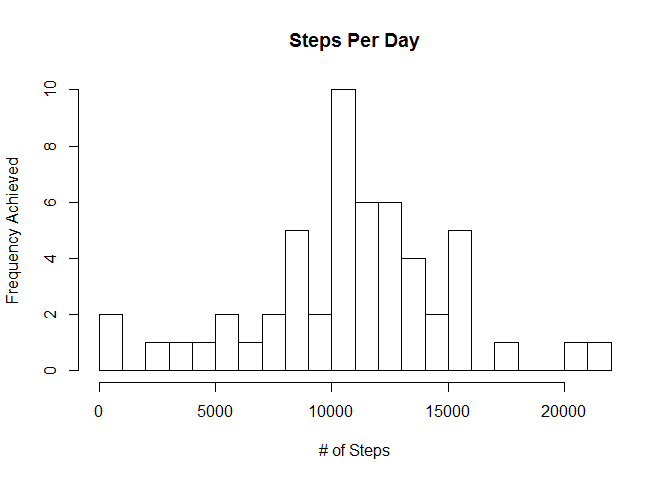
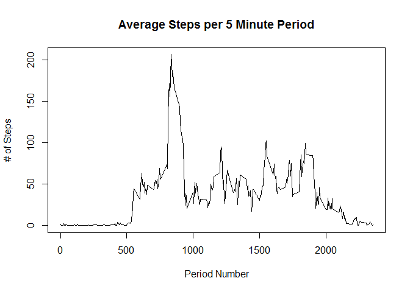
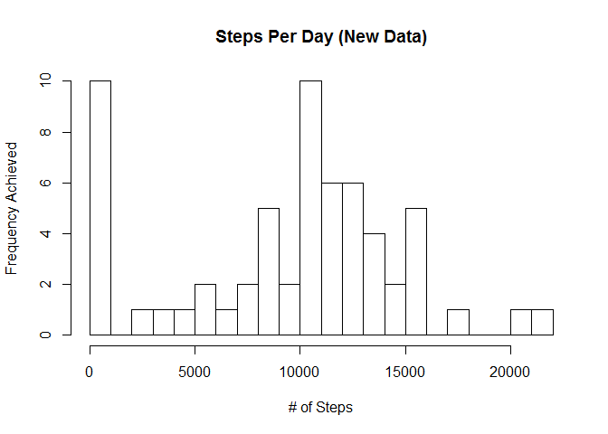
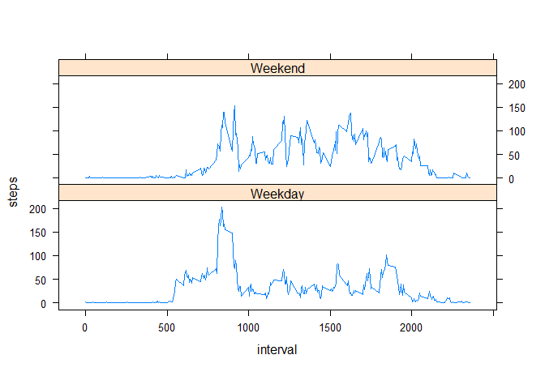

# Reproducible Research: Peer Assessment 1

# Reproducible Research: Project 1

## Introduction
This markdown file outlines the steps taken for reproducing research tasks outlined in Coursera's Reproducible Research Project #1.  The data is made of physical activity monitoring observations from a particular subject during the months of October and November 2012.

This script loads, cleans, analyzes and processes the data as shown below.


# Download and Read Data

```r
library(reshape2)
# Download and unzip the dataset:

zipFile <- "dataset.zip"

if (!file.exists(zipFile)){
  fileURL <- "https://d396qusza40orc.cloudfront.net/repdata%2Fdata%2Factivity.zip"
  download.file(fileURL, zipFile, method="curl")
} 

if (!file.exists("ActivityData")) { 
  unzip(zipFile) 
}

# Read data into R

dataRaw <- read.csv("activity.csv")
```

# Perform Data Processing

```r
data <- aggregate(steps ~ date, data = dataRaw, sum, na.rm = TRUE)
```

# Create Exploratory Plot

```r
hist(data$steps, breaks = 30, main = "Steps Per Day", xlab = "# of Steps", ylab = "Frequency Achieved")
```

<!-- -->

The historgram above shows simple view of the distribution of total steps taken each day over the two month period.  We need to look at statistical figures to get a more accurate sense of these numbers.

# Calculate Mean and Median of Steps Achieved Per Day

```r
stepMedianDaily <- median(data$steps, na.rm = TRUE)
stepMedianDaily
```

```
## [1] 10765
```

```r
stepMeanDaily <- mean(data$steps, na.rm = TRUE)
stepMeanDaily
```

```
## [1] 10766.19
```

# Construct 5 Minute Time Series Plot of Average Step Activity

```r
step5min <- aggregate(steps ~ interval, data=dataRaw, mean, na.rm = TRUE)
plot(step5min$interval, step5min$steps, type = "l", 
     main = "Average Steps per 5 Minute Period", xlab = "Period Number",ylab="# of Steps")
```

<!-- -->

```r
# Find Maximum number of steps in five minute interval
step5minMax <- max(step5min$steps)
step5minMax
```

```
## [1] 206.1698
```

# Addressing missing values in data
We can impute the values for missing data in various ways, I have chosen to use the median value in the dataset to replace the NA values.

```r
# Calculate number of NA values in dataset
dataNAsum <- sum(is.na(dataRaw$steps))
dataNAsum
```

```
## [1] 2304
```

```r
# Calculate percentage of data that is an NA value
dataNAmean <- mean(is.na(dataRaw$steps))
dataNAmean
```

```
## [1] 0.1311475
```

```r
# Create new dataset with no NA values
dataNew <- dataRaw
dataNew$steps[is.na(dataNew$steps)] <- median(dataRaw$steps, na.rm = TRUE)
```

# Create xploratory plot on new data set

```r
dataNewHist <- aggregate(steps~date, data=dataNew, sum, na.rm = TRUE)
hist(dataNewHist$steps, breaks = 30, main = "Steps Per Day (New Data)", xlab = "# of Steps",     ylab = "Frequency Achieved")
```

<!-- -->

We can calculate the revised mean and median from the new dataset.

```r
# Calculate number of NA values in dataset
stepMedianNew <- median(dataNewHist$steps, na.rm = TRUE)
stepMedianNew
```

```
## [1] 10395
```

```r
stepMeanNew <- mean(dataNewHist$steps, na.rm = TRUE)
stepMeanNew
```

```
## [1] 9354.23
```

# Examine differences between activity on weekdays and weekends
It is useful to look at the differences in physical activity between and weekends and weekdays.  To accomplish this I will plot two charts below:

```r
require(lattice)
dataNew$date <- as.Date(dataNew$date)
dataNew$DayofWeek <- weekdays(dataNew$date)
dataNew$WeekEndFlag <- ifelse(dataNew$DayofWeek == "Saturday" | dataNew$DayofWeek == "Sunday",   "Weekend", "Weekday")

panelPlot <- aggregate(steps~interval + WeekEndFlag, dataNew, mean)
xyplot(steps ~ interval | factor(WeekEndFlag), data = panelPlot, type = "l", aspect = 1/4)
```

<!-- -->
